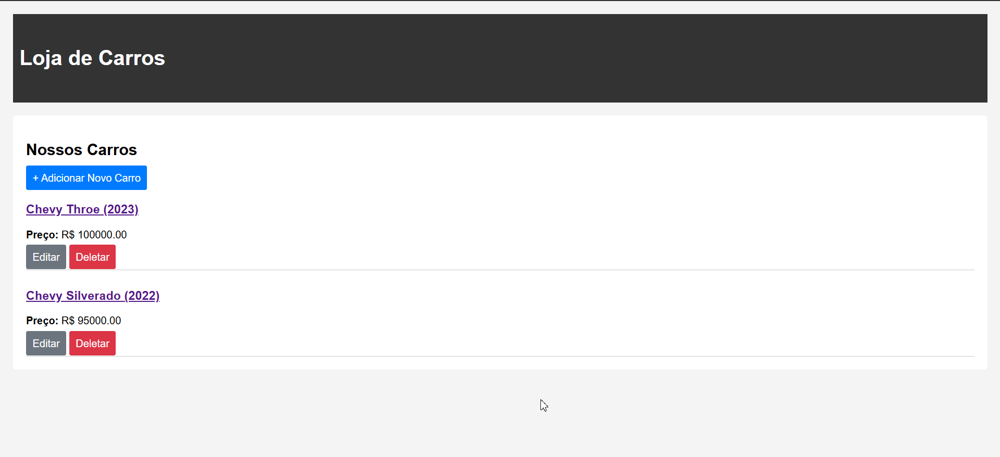
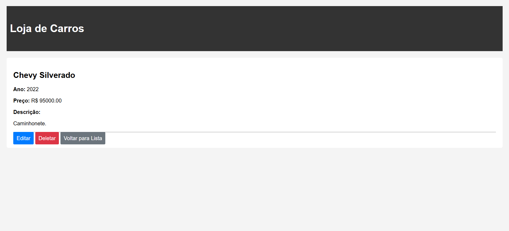
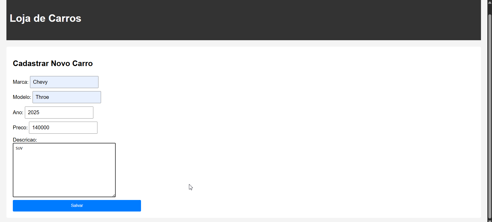
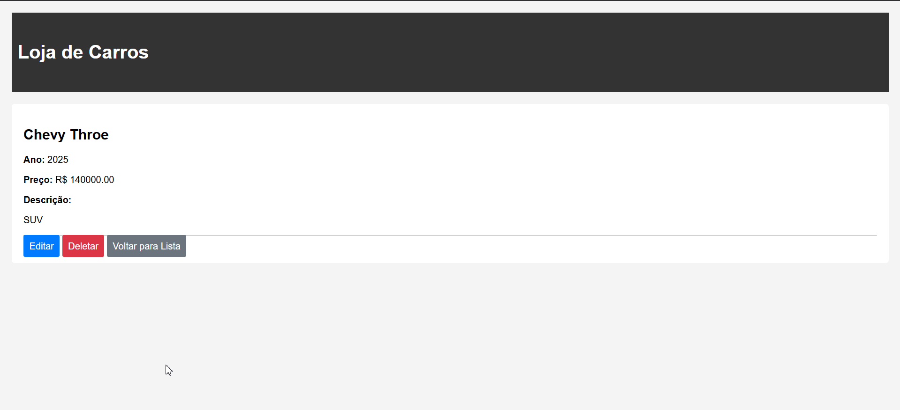
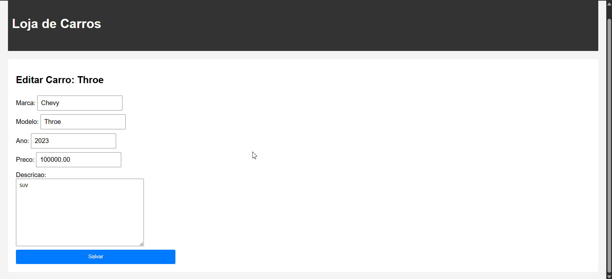
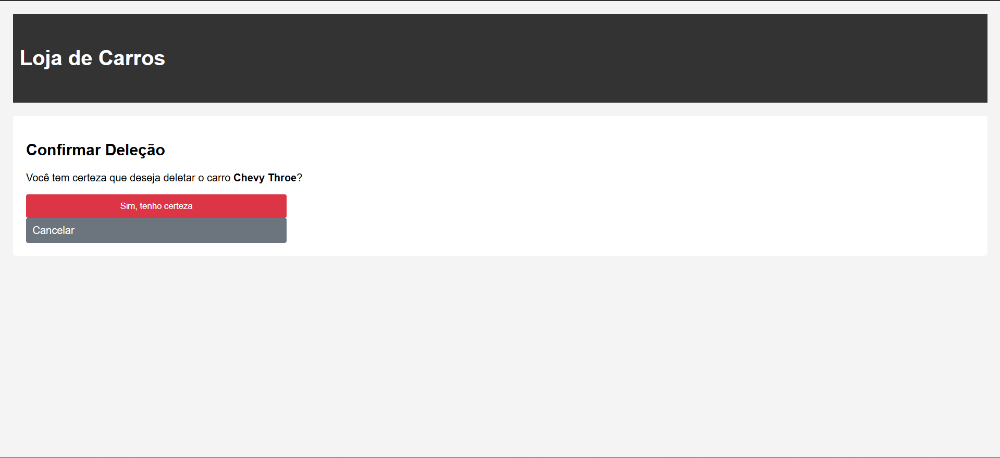

Rotas Principais

1. Listar carros

URL: `/`
Nome da Rota: `carro_listar`
View Responsável: `CarroListView`
Template: `loja/listar.html`

2. Detalhar carros

URL: `/carro/<int:pk>/`
Nome da Rota (Django): `carro_detalhe`
View Responsável: `CarroDetailView`
Template: `loja/detalhe.html`

3. Adicionar carros

URL: `/carro/novo/`
Nome da Rota (Django): `carro_novo`
View Responsável: `CarroCreateView`
Template: `loja/form.html`

4. Editar carros

URL: `/carro/<int:pk>/editar/`
Nome da Rota (Django): `carro_editar`
View Responsável: `CarroUpdateView`
Template:** `loja/form.html`

5. Deletar carros

URL: `/carro/<int:pk>/deletar/`
Nome da Rota (Django):** `carro_deletar`
View Responsável:`CarroDeleteView`
Template:`loja/confirm_delete.html`

